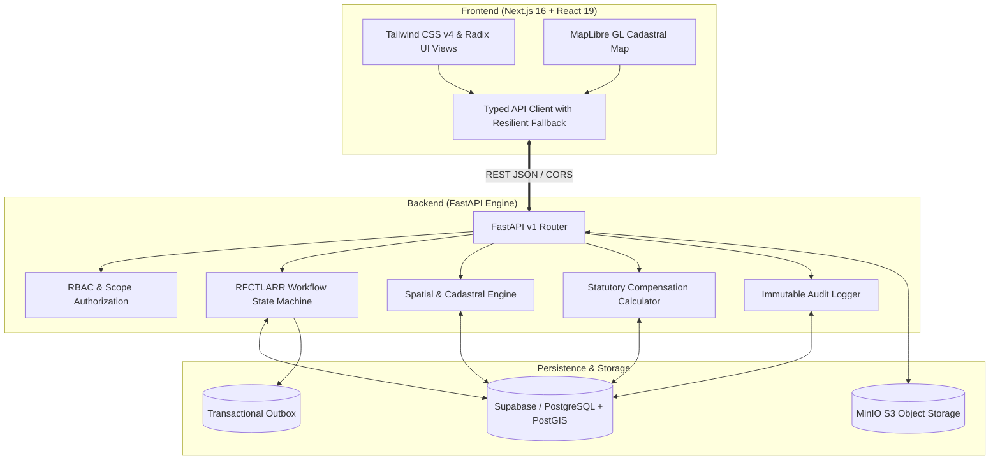

# 🗺️ BhuSetu: Developer Handover & Status Documentation

Welcome to the **BhuSetu** project documentation repository. This master guide provides new developers, evaluators, and maintainers with an immediate understanding of the project's vision, system architecture, implemented milestones, and remaining development roadmap.

---

## 📌 Project Overview

**Problem Statement (SIH 26016):** Digital Transformation of Cadastral Land Acquisition, Statutory Compliance under RFCTLARR Act 2013, and Automated Compensation Disbursement for Infrastructure Corridors.

**BhuSetu** is an end-to-end digital lifecycle governance platform tailored for the **Ministry of Road Transport and Highways (MoRTH)**, the **National Highways Authority of India (NHAI)**, and State Revenue Departments. It eliminates paper-based delays, boundary overlap litigations, and disbursement fraud.

---

## 🏛️ System Architecture



---

## 📚 Detailed Component Guides

Please refer to the dedicated documentation files for granular technical breakdowns, setup instructions, completed features, and pending roadmaps:

| Document | Focus Area | Key Highlights |
| :--- | :--- | :--- |
| 📄 **[FRONTEND.md](file:///c:/Users/yg159/OneDrive/Desktop/sih/BhuSetu/docs/FRONTEND.md)** | Next.js App Router, MapLibre GIS, UI Components | All 8 Stakeholder Views, Citizen Search, Offline Fallback, Pending GIS Drawing Tools |
| 📄 **[BACKEND.md](file:///c:/Users/yg159/OneDrive/Desktop/sih/BhuSetu/docs/BACKEND.md)** | FastAPI, Supabase PostGIS, MinIO Storage | Workflow State Machine, Compensation Formula, Outbox Pattern, 17 Passing Tests |

---

## ⚡ Quick Start (Running Both Services Locally)

### 1. Start Docker Object Storage (MinIO)
```bash
# From project root:
docker compose up -d
```
- Console: [http://localhost:9001](http://localhost:9001) (User: `minioadmin` / Pass: `minioadmin`)

### 2. Start FastAPI Backend
```bash
cd backend

# Windows
.\venv\Scripts\activate
# Linux/macOS
# source venv/bin/activate

# Start server on port 8000
uvicorn main:app --reload --port 8000
```
- API Docs (Swagger): [http://localhost:8000/docs](http://localhost:8000/docs)
- Health Check: [http://localhost:8000/health](http://localhost:8000/health)

### 3. Start Next.js Frontend
```bash
cd frontend

# Install dependencies (if not done)
npm install

# Start development server on port 3000
npm run dev
```
- Web Portal: [http://localhost:3000](http://localhost:3000)

---

## 📊 Summary Status Matrix

| Module | Status | Primary Files | Details |
| :--- | :---: | :--- | :--- |
| **Landing & Citizen Inquiry** | ✅ Complete | `frontend/app/page.tsx` | Khasra search, Section 11/19 trackers, public objections |
| **Stakeholder Portals** | ✅ Complete | `frontend/components/views/*` | CALA, PIA, Revenue Officer, Citizen PAF, Central Authority |
| **Interactive Cadastral GIS** | 🟡 85% | `frontend/app/dashboard/gis/page.tsx` | MapLibre vector viewer works; dynamic polygon editor pending |
| **Statutory State Machine** | ✅ Complete | `backend/app/services/workflow_service.py` | Full RFCTLARR 2013 lifecycle transition validation |
| **Compensation Engine** | ✅ Complete | `backend/app/services/compensation_service.py` | Market value, solatium (100%), 12% additional interest |
| **PFMS DBT Payments** | 🟡 80% | `backend/app/api/v1/compensation.py` | Batch initiation & status transitions done; bank webhook pending |
| **Database Migrations** | ✅ Complete | `backend/db/migrations/001-008` | PostGIS schema, spatial tables, RPCs, seed fixtures |
| **Object Storage (MinIO)** | ✅ Complete | `backend/storage/minio_client.py` | Presigned URLs, auto-bucket creation on docker startup |
| **Automated Tests** | ✅ Complete | `backend/tests/` | 17/17 automated unit and integration tests passing |

---

## 👥 Stakeholder Role Mapping

The platform enforces strict Role-Based Access Control (RBAC):

1. **PIA (Project Implementing Agency - NHAI / MoRTH)**: Initiates projects, uploads DPR KML alignments, requests land surveys.
2. **CALA / Collector (Competent Authority Land Acquisition)**: Statutory authority responsible for Gazette notifications (Sec 11, 15, 19) and award declaration.
3. **Revenue Officer / Amin / Surveyor**: Conducts ground-truth survey, captures geo-tagged photos, verifies land records and encumbrances.
4. **Compensation & Accounts Officer**: Prepares compensation matrices, initiates PFMS DBT payment batches to beneficiaries.
5. **R&R Administrator**: Tracks Project Affected Families (PAF), resettlement colonies, and annuity grants.
6. **Citizen / Landowner (PAF)**: Public access to track Khasra acquisition status, compensation awards, and file objections.
7. **Central MoRTH / Auditor**: Macro-level dashboard, cross-state corridor monitoring, and tamper-evident audit logs.
